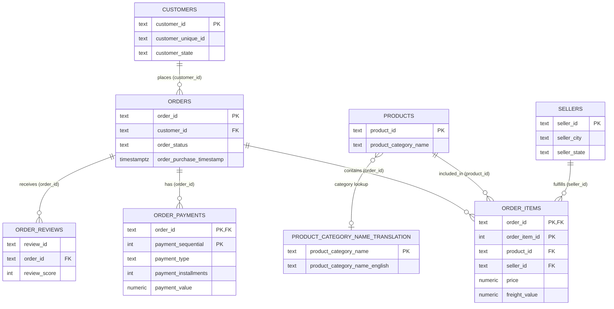

# Database Schema

> Status: validated against the live Supabase instance. Every constraint listed
> below was inspected via `pg_constraint` / `pg_indexes` and every cardinality
> claim was verified with SQL. See [Validation report](#validation-report).
> Standalone copy of the diagram: `docs/diagrams/er-diagram.mmd`.

## Conceptual arrangement (readable order)

The recommended reading order groups tables by role, not alphabetically:

```text
                  PRODUCTS  ──►  CATEGORY TRANSLATION
                     │  (product_id)
                     ▼
                  ORDER_ITEMS ◄── SELLERS
                     │  (order_id)
                     ▼
                   ORDERS ◄────── CUSTOMERS
                  /    \
    (order_id)   ▼      ▼  (order_id)
        ORDER_PAYMENTS  ORDER_REVIEWS

   GEOLOCATION  ── treated as reference/enrichment only (zip prefix, not an FK)
```

## ER diagram (Mermaid, GitHub-renderable)

Cardinality below reflects what was **validated with data** (0 orphans, 0
duplicate PK rows, composite keys confirmed). `geolocation` is intentionally
omitted from the relationship lines: it is a lookup keyed by
`zip_code_prefix`, and only an association, not a real FK.



## Tables, PKs, FKs, grain (validated)

| # | Table | Primary key | Foreign keys | Grain / notes |
|---|-------|-------------|--------------|---------------|
| 1 | `customers` | `customer_id` | – | One row per order-customer record; **people** are `customer_unique_id` (2,997 of them map to >1 `customer_id`) |
| 2 | `orders` | `order_id` | `customer_id → customers` | One row per order (99,441); central fact table |
| 3 | `order_items` | `(order_id, order_item_id)` | `order_id → orders`; `product_id → products`; `seller_id → sellers` | One row per delivered line item. **Never join to `order_payments` when summing money** (multiplies payment_value) |
| 4 | `order_payments` | `(order_id, payment_sequential)` | `order_id → orders` | One row per payment event; **1 order → n payments** (2,246 split-payment orders) |
| 5 | `order_reviews` | none **→ `UNIQUE (review_id, order_id)`** | `order_id → orders` | One row per review per order occurrence. `review_id` is **not** unique (789 values reused across different orders) so it cannot be a PK |
| 6 | `products` | `product_id` | – | One row per product (32,951) |
| 7 | `sellers` | `seller_id` | – | One row per seller (3,095) |
| 8 | `geolocation` | **none** (deliberate) | – | 1,000,163 rows; many share one `zip_code_prefix` ⇒ **do not** promote that column to PK/FK unless the data is deduplicated. Reference/enrichment only |
| 9 | `product_category_name_translation` | `product_category_name` | – | Lookup; `products.product_category_name → translation.product_category_name` (some product categories are NULL ⇒ zero-or-one match) |

## Relationship descriptions (one-to-many)

| From | To | Key | Notes |
|------|----|-----|-------|
| `customers` | `orders` | `customer_id` | 1 customer record → 0..n orders; per **person** (unique_id) it is 1..n. |
| `orders` | `order_payments` | `order_id` | Strict 1..n; aggregate payments at payment grain first. |
| `orders` | `order_items` | `order_id` | 1..n line items. |
| `orders` | `order_reviews` | `order_id` | 0..n reviews (an order can carry several reviews). |
| `products` | `order_items` | `product_id` | 1..n lines across orders. |
| `sellers` | `order_items` | `seller_id` | 1..n lines across orders. |
| `products` | `translation` | `product_category_name` | 0..n products per translation row; NULL categories have no match. |

Deliberately **not** modelled: `orders → products` and `orders → sellers`
direct links — they exist only through `order_items`, preserving granularity.

## Built-in constraints & indexes (as inspected)

- PKs: `customers`, `orders`, `products`, `sellers`, `translation`; composite
  PKs on `order_items` and `order_payments`; **none** on `geolocation`.
- FKs (all `ON DELETE` default, all orphan-free — 0 orphans in each direction):
  `order_items→orders/products/sellers`, `order_payments→orders`,
  `order_reviews→orders`, `orders→customers`.
- Unique: `order_reviews_grain_unique (review_id, order_id)` — added 2026-08 to
  lock the provable review row grain.
- Indexes: PK indexes + analytical ones (`idx_customers_state`, `idx_customers_unique_id`,
  `idx_customers_zip_code`, `idx_geolocation_zip`, `idx_items_product`,
  `idx_items_seller`, `idx_payments_installments`, `idx_payments_type`,
  `idx_reviews_id/order/score`, `idx_orders_customer_id/purchase_ts/status`,
  `idx_products_category`).

## Key modeling decisions

1. **`customer_id` vs `customer_unique_id`** — `customer_id` is a synthetic
   id per order; `customer_unique_id` identifies the person. Count distinct
   customers **by `customer_unique_id`** (96,096). A `customer_id` maps 1:1 to
   an order, so joining on it never fans out.
2. **Payments are 1..n per order** — split payments (2,246 orders) produce
   several rows; `payment_value` must be summed **at order_payments grain**
   before any other join.
3. **`order_items` composite key** — `(order_id, order_item_id)` because one
   order can contain the same product/seller on multiple lines. It is the only
   table linking `orders`, `products` and `sellers`, so `orders`↔`products` and
   `orders`↔`sellers` must always traverse it.
4. **`order_reviews` has no single-column PK** — the source reuses 789
   `review_id` values across different orders (same comment/timestamps
   attached twice). The provable grain is `(review_id, order_id)`, enforced
   with a UNIQUE constraint; the dashboard therefore groups strictly by
   `order_id` when joining reviews.
5. **`geolocation` ZIP-prefix caveat** — `geolocation_zip_code_prefix` appears
   up to 750× (1,000,163 rows, many per prefix). It is a lookup for
   city/state enrichment; it is **not** a PK or FK and no artificial PK was
   created (uniqueness is not provable). If `customers`/`sellers` geography is
   ever needed, `zip_code_prefix` is the (lossy) join column.
6. **Category translation** — pure lookup; product categories are stored in
   Portuguese, translation in English. Join is optional and lossless in both
   directions (71 rows).

## Validation report

Inspected live on `rdtipdwlvxzefyffklvn` (2026-08-29):

| Check | Result |
|---|---|
| Row counts | customers 99,441 · orders 99,441 · order_items 112,650 · order_payments 103,886 · order_reviews 99,224 · products 32,951 · sellers 3,095 · geolocation 1,000,163 · translation 71 ✅ |
| PK candidates (null/dup) | 0 duplicates / 0 NULLs on every configured PK ✅ |
| `review_id` uniqueness | **789 values reused** across orders ⇒ correctly **not** a PK ✅ |
| `(review_id, order_id)` duplicates | 0 ⇒ grain is sound; UNIQUE constraint added ✅ |
| Orphan FKs | 0 in all six FK directions ✅ |
| Negative prices | 0 ✅ |
| `geolocation` has no artificial PK | confirmed ✅ |

## SQL object inventory

| Object | Purpose |
|---|---|
| `01_database_setup.sql` | DDL: tables, PKs, FKs, UNIQUE grain constraint, indexes |
| `02_data_quality_checks.sql` | validation queries + expected values |
| `03_kpi_queries.sql` | headline KPIs |
| `04_payment_analysis.sql` | payment type + installments |
| `05_customer_analysis.sql` | top customers, states, concentration |
| `06_product_analysis.sql` | top categories |
| `07_review_analysis.sql` | customer experience |
| `08_dashboard_views.sql` | `vw_*` views consumed by the dashboard |